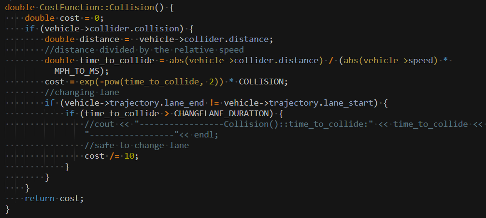

## P1-Path-Planning
   
### Goals
In this project your goal is to safely navigate around a virtual highway with other traffic that is driving +-10 MPH of the 50 MPH speed limit. You will be provided the car's localization and sensor fusion data, there is also a sparse map list of waypoints around the highway. The car should try to go as close as possible to the 50 MPH speed limit, which means passing slower traffic when possible, note that other cars will try to change lanes too. The car should avoid hitting other cars at all cost as well as driving inside of the marked road lanes at all times, unless going from one lane to another. The car should be able to make one complete loop around the 6946m highway. Since the car is trying to go 50 MPH, it should take a little over 5 minutes to complete 1 loop. Also the car should not experience total acceleration over 10 m/s^2 and jerk that is greater than 10 m/s^3.

### Simulator.
You can download the Term3 Simulator which contains the Path Planning Project from the [releases tab (https://github.com/udacity/self-driving-car-sim/releases).

#### The map of the highway is in data/highway_map.txt
Each waypoint in the list contains  [x,y,s,dx,dy] values. x and y are the waypoint's map coordinate position, the s value is the distance along the road to get to that waypoint in meters, the dx and dy values define the unit normal vector pointing outward of the highway loop.

The highway's waypoints loop around so the frenet s value, distance along the road, goes from 0 to 6945.554.

## Basic Build Instructions

1. Clone this repo.
2. Make a build directory: `mkdir build && cd build`
3. Compile: `cmake .. && make`
4. Run it: `./path_planning`.

Here is the data provided from the Simulator to the C++ Program

#### Main car's localization Data (No Noise)

["x"] The car's x position in map coordinates

["y"] The car's y position in map coordinates

["s"] The car's s position in frenet coordinates

["d"] The car's d position in frenet coordinates

["yaw"] The car's yaw angle in the map

["speed"] The car's speed in MPH

#### Previous path data given to the Planner

//Note: Return the previous list but with processed points removed, can be a nice tool to show how far along
the path has processed since last time. 

["previous_path_x"] The previous list of x points previously given to the simulator

["previous_path_y"] The previous list of y points previously given to the simulator

#### Previous path's end s and d values 

["end_path_s"] The previous list's last point's frenet s value

["end_path_d"] The previous list's last point's frenet d value

#### Sensor Fusion Data, a list of all other car's attributes on the same side of the road. (No Noise)

["sensor_fusion"] A 2d vector of cars and then that car's [car's unique ID, car's x position in map coordinates, car's y position in map coordinates, car's x velocity in m/s, car's y velocity in m/s, car's s position in frenet coordinates, car's d position in frenet coordinates. 

## Details

1. The car uses a perfect controller and will visit every (x,y) point it recieves in the list every .02 seconds. The units for the (x,y) points are in meters and the spacing of the points determines the speed of the car. The vector going from a point to the next point in the list dictates the angle of the car. Acceleration both in the tangential and normal directions is measured along with the jerk, the rate of change of total Acceleration. The (x,y) point paths that the planner recieves should not have a total acceleration that goes over 10 m/s^2, also the jerk should not go over 10 m/s^3. (NOTE: As this is BETA, these requirements might change. Also currently jerk is over a .02 second interval, it would probably be better to average total acceleration over 1 second and measure jerk from that.

2. There will be some latency between the simulator running and the path planner returning a path, with optimized code usually its not very long maybe just 1-3 time steps. During this delay the simulator will continue using points that it was last given, because of this its a good idea to store the last points you have used so you can have a smooth transition. previous_path_x, and previous_path_y can be helpful for this transition since they show the last points given to the simulator controller with the processed points already removed. You would either return a path that extends this previous path or make sure to create a new path that has a smooth transition with this last path.

## Tips

A really helpful resource for doing this project and creating smooth trajectories was using http://kluge.in-chemnitz.de/opensource/spline/, the spline function is in a single hearder file is really easy to use.

---

## Dependencies

* cmake >= 3.5
 * All OSes: [click here for installation instructions](https://cmake.org/install/)
* make >= 4.1
  * Linux: make is installed by default on most Linux distros
  * Mac: [install Xcode command line tools to get make](https://developer.apple.com/xcode/features/)
  * Windows: [Click here for installation instructions](http://gnuwin32.sourceforge.net/packages/make.htm)
* gcc/g++ >= 5.4
  * Linux: gcc / g++ is installed by default on most Linux distros
  * Mac: same deal as make - [install Xcode command line tools]((https://developer.apple.com/xcode/features/)
  * Windows: recommend using [MinGW](http://www.mingw.org/)
* [uWebSockets](https://github.com/uWebSockets/uWebSockets)
  * Run either `install-mac.sh` or `install-ubuntu.sh`.
  * If you install from source, checkout to commit `e94b6e1`, i.e.
    ```
    git clone https://github.com/uWebSockets/uWebSockets 
    cd uWebSockets
    git checkout e94b6e1
    ```

---

**1. Project files**
* main.cpp
    * receive msg(lane, target_speed_mph, vehicle object,waypoints[x,y], array[s,d]) from simulator
* cost_function.cpp, cost_function.h
    * define multi type costs e.g. collision, changelane and inefficiency...and calc realtime sum(costs) for each input condition
* vehicle.cpp, vehicle.h
    * maintain & monitor vehicle object's current speed, target speed, acceleration, jerk, lane, target lane, FSM states
* spline.h
    * added for usage of spline polynomial represenation for all waypoints

**2. Project Outline**

###### The goals / steps of this project are the following:
* design acceleration to let vehicle reach 50mph on the initialized lane
* design collision ahead detection, if collision is possible the vehicle starts to brake until relative statick with ahead obstacle car
* design various cost functions, in above case the vehicle will calc at each timestamp for sum(costs) of 1) collision: too close to other car is heavily punished 2) too slow staying on same lane and cannot reach max.speed 49.5mph will be punished for inefficiency 3) change lane discomfort penalty 4) too slow to reach the possible target speed = front car speed, if blocked by front car
* design FSM state buffer, for each timestamp the vechile will calc the minimum sum(costs) of any possible next_state, which is derived from current_state in FSM 
* once minimum next_state is chosen, the vehicle will immediately update its state, target_lane, target_speed with the next_state, i.e. switch into this new state in FSM


**3. FSM states**


The FSM works this way: 
* Depending on the system context (highway), the FSM may stay at KP state or change to Prepare to Change Lane Left or Right. At each state, all possible states are evaluated using a cost function and the state with the minimum cost is selected. 
    * Keep Lane (KP) state. The car will stay in the same lane (KL) if there is no other vehicle that prevents it from reaching the maximum legal speed limit of the road.

    * prepare to change lanes (PLCL or PLCR). only the possible lane change (PLCL or PLCR) is available if the car is in one of the lateral lanes (lanes 0 or 2); 
If the PLCL or PLCR are selected, the car prepares to change lane. The preparation checks if the car speed and the buffer space are safe to change lance. The car may stay in the PLC_ state until the buffer is safe enough to change lane or even decide to return to state KL (same lane) if the cost to change the lane is no longer relevant;

    * LCL/LCR: When there is enough buffer space to change lane, the FSM will transition to LCL/LCR states. The FSM returns to state KL as soon the lane change is over (car is between the lane lines).

**4. cost functions**


* collision cost: most majorirty cost
    * from above picture, to avoid collision (to ahead) is the primary requirement for behavior planning design, therefore I set 10e6 as coefficience for collision cost; 
    * the less time to rush to the ahead car, the closer the collision distance, the higher the cost;
    * however, if in neighboring lane, if there is enough time to change lane, time_to_collide > CHANGELANE_DURATION = 1 second, then collision cost reduce by /10, to be at same level as change lane danger, otherwise collision cost can 10 times larger, i.e. always occupy 90% of sum(costs), then vehicle won't dare to change lane !


* change lane cost: to avoid the vehicle change lane with no costs
    * set change lane security buffer CHANGELANE_DURATION = 1 second, in time_steps the ego vehicle will crash to neighboring car in the target lane, if there is enough discance gap and time_steps, cost is 0;
    * else the more time_steps the less cost;
    * if the distance gap collider.changelane_gap < 0, means there is only neighboring car on target lane but at behind, then because from speed control I have guarantee ego vehicle is always faster than behind cars, so change lane cost now can be reduced by /10


* change lane comfort cost:
    * set this cost to avoid unnecessary frequent lane changes


* inefficiency cost: to punish the vehicle stays on lane with lower speed than 50 mph and when there is gap for lane change but vehicle is too lazy for change
    * the closer vehicle speed to max speed 49.5 mph, the lower the cost


* target cost: 
    * the closer vehicle speed to target speed set by neighboring cars, the lower the cost


**5. path generation with spline**
Spline is a piecewise "polynomial" parametric curve. They are popular for their simplicity of use and accuracy. Our path planner uses the Spline mathematical function for curve fitting the generated map coordinates. The spline helps to define a smooth path for the car 

The path generation is an elaborate set of tasks. First, our planner has to generate equally spaced map coordinates. We use the helper function "getXY" to generate points from Freenet to Cartesian coordinates.

After, we shift the orientation to the ego car for simplicity and feed the points to the spline generator. We used the Cubic Spline library to generate the spline curve.

After, with the spline function already done, we have to recompute the map points back from the curve. This task is accomplished by breaking up the spline into equidistant points that respect the desired speed (see Figure X).

Finally, the final part is to compute the coordinates from spline and shift its orientation back.

**6. max speed, acceleration and jerk control**
